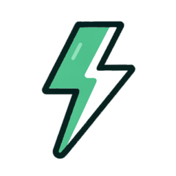

<div align="center">
  
</div>

[](https://github.com/tokenizedev/tknzv1/actions/workflows/ci.yml)

 # TKNZ (Tokenize) Chrome Extension

 TKNZ (pronounced "tokenize") is a Chrome extension that lets you create meme coins on Pump.fun directly from news articles and tweets. It provides a simple UI to manage a Solana wallet, extract article or tweet data (title, image, description) and generate token metadata, then launch tokens with a specified investment amount.

 ## Table of Contents
 - [Goals](#overview)
 - [Features](#features)
 - [Getting Started](#getting-started)
   - [Prerequisites](#prerequisites)
   - [Installation](#installation)
   - [Environment Variables](#environment-variables)
 - [Development](#development)
 - [Build & Packaging](#build--packaging)
 - [Chrome Extension Installation](#chrome-extension-installation)
 - [Scripts](#scripts)
 - [Directory Structure](#directory-structure)
 - [Architecture](#architecture)
 - [SDK Token Creation API](#sdk-token-creation-api)
 - [Contributing](#contributing)
 - [Code of Conduct](#code-of-conduct)
 - [Roadmap](#roadmap)
 - [License](#license)

 ## Overview
 - Simplify the workflow for launching meme coins based on article or tweet content.
 - Abstract the complexity of Solana SPL token creation and metadata hosting.
 - Provide real-time SOL and token balance updates.
 - Integrate with Pump.fun for token creation and pools.
 - Track key events (balance updates, token launches) via Firebase (optional).
 - Support modern web apps and dynamic content (e.g., SPAs, Twitter/X posts).

 ## Features

 TKNZ offers a comprehensive suite of features for creating and managing meme coins:

 ### Content Tokenization
 - **Isolated Tokenization** — Select specific sections of a webpage to tokenize, allowing you to precisely target the content that matters most for your token creation.
 - **Custom Token Image Uploads** — Upload your own images for token creation instead of relying solely on extracted content, giving you more control over token branding.
 - **Custom AI Prompts** — Fine-tune the AI token generation process with personalized prompts to create tokens that better reflect your vision.

 ### User Experience
 - **Pin Extension** — Lock TKNZ on-screen as a sidebar for rapid token launches while browsing, eliminating the need to switch between windows or tabs.
 - **Automatic Wallet Provisioning** — Get started immediately with automatically created Solana wallets, removing barriers to entry for new users.

 ### Community & Engagement
 - **Token Leaderboard** — Track top token launches in real-time to see which coins are gaining momentum in the community.
 - **"Coin Create" Contest** — Participate in community challenges that incentivize creative and innovative token launches.

 ### Developer Tools
 - **Leaderboard API** — Access token performance data programmatically through our API, enabling integration with external tools and services.

 ### User Education
 - **Explainer Video** — Watch comprehensive tutorials on our main website to quickly understand how to use all TKNZ features effectively.

 ### Core Functionality
 - Extract title, image, and description from articles and tweets
 - Generate token metadata via an AI-powered Creation API
 - Host metadata on IPFS through Pump.fun
 - Create and fund Solana SPL tokens with configurable investment amounts
 - View and refresh SOL and token balances
 - Version checking and update prompts

 ## Getting Started

 ### Prerequisites
 - Node.js >= 16.x
 - npm (>= 8.x) or yarn
 - Chrome or any Chromium-based browser

 ### Installation
 1. Clone the repository:
    ```bash
    git clone https://github.com/tokenizedev/tknzv1.git
    cd tknzv1
    ```
 2. Install dependencies:
    ```bash
    npm install
    # or
    yarn install
    ```
 3. Generate a private key for packaging (one-time):
    ```bash
    npm run keygen
    ```
    This creates `extension.pem` used by CRXJS for signing.

 ### Environment Variables
 Create a `.env` file in the project root with the following:
 ```ini
 VITE_FIREBASE_API_KEY=<Your Firebase Web API Key>
 ```
 Optionally override the app version:
 ```ini
 VITE_APP_VERSION=0.2.3
 ```
 
 # Affiliate (Referral) Fee Configuration
 The extension can include an affiliate referral fee on Jupiter Ultra swaps. Configure:
 ```ini
 # Your affiliate/referral Solana wallet public key
 VITE_AFFILIATE_WALLET=<Your referral wallet address>
 # (Optional) Referral fee in basis points (bps), default is 50
 VITE_AFFILIATE_FEE_BPS=50
 ```

 ## Development

 Do a build

 ```bash
 yarn build
 ```

 Load the extension as an unpacked extension:
 1. Navigate to `chrome://extensions/`.
 2. Enable **Developer mode**.
 3. Click **Load unpacked** and select the `dist` folder from the root.
 4. Click the TKNZ icon in the toolbar to open the popup.

 ## Build & Packaging

 Build for production:
 
 ```bash
 yarn build
 ```
 
 Release (bump version, build, package):
 ```bash
 npm release
 ```
 The generated `release/[version].zip` file will be in the `release` folder.

 ## Chrome Extension Installation
 To install the built extension

 1. Drag and drop the `.crx` file into `chrome://extensions/`.
 2. Confirm installation.
 Alternatively, load the `dist/` folder as an unpacked extension.

 ## Scripts
 - `npm run dev`         — Start development server with HMR.
 - `npm run build`       — Build extension (includes TypeScript compile).
 - `npm run build:crx`   — Alias for build.
 - `npm run lint`        — Run ESLint.
 - `npm run preview`     — Preview the build locally.
 - `npm run bump`        — Bump version and create Git tag.
 - `npm run keygen`      — Generate `extension.pem` for packaging.
 - `npm run package`     — Package into CRX.
 - `npm run release`     — Build, bump version, and package.
 - `npm run test`        — Run unit tests in watch mode.
 - `npm run test:ci`     — Run tests once with coverage.

 ## Directory Structure
 ```
 .
 ├── public/                # Static assets (icons, images)
 ├── src/                   # Extension source code
 │   ├── background.ts      # Background service worker
 │   ├── contentScript.tsx  # Content script for data extraction
 │   ├── firebase.ts        # Firebase analytics
 │   ├── App.tsx            # React popup UI
 │   ├── main.tsx           # React entry point
 │   ├── store.ts           # Zustand store (wallet & token logic)
 │   ├── components/        # React components (WalletSetup, CoinCreator, etc.)
 │   └── config/            # Configuration (version, etc.)
 ├── scripts/               # Helper scripts (keygen, postbuild)
 ├── manifest.json          # Chrome extension manifest (MV3)
 ├── package.json           # npm scripts & dependencies
 ├── vite.config.ts         # Vite + CRXJS config
 ├── tsconfig.json
 └── README.md              # <-- You are here
 ```
  
 ## Architecture
 
 ```mermaid
 graph LR
   subgraph "Chrome Extension"
     CS["Content Script"]
     BG["Background Service Worker"]
     UI["React Popup UI"]
     Store["Zustand Store"]
   end

   subgraph "External Services"
     AI["Token Creation API"]
     PumpFun["Pump.fun API & IPFS"]
     Solana["Solana Blockchain"]
     Firebase["Firebase Analytics"]
   end

   CS -->|Extract content| BG
   UI -->|User actions| BG
   BG -->|State updates| Store
   BG -->|Generate metadata| AI
   BG -->|Upload metadata| PumpFun
   BG -->|Create & fund tokens| Solana
   BG -->|Log events| Firebase
   Store -->|State| UI
 ```

## SDK Token Creation API

The **TKNZ Extension SDK** injects a `tknz` object into the page context, allowing you to programmatically initiate the token creation flow directly from any webpage.

### window.tknz.initTokenCreate(options)

**Signature:**  
`window.tknz.initTokenCreate(options: Partial<CoinCreationParams>): void`

**Description:**  
Launches the extension UI (popup or side panel) and pre-fills the token creation form with your provided options.

**Parameters (`options`):**  
- `name` (string, optional): Token name.  
- `ticker` (string, optional): Token symbol (e.g., "TKNZ").  
- `description` (string, optional): Token description.  
- `imageUrl` (string, optional): URL to the token image.  
- `imageFile` (Blob, optional): Image file blob (provide either `imageUrl` or `imageFile`).  
- `websiteUrl` (string, required for creation): Project or website URL in token metadata.  
- `twitter` (string, optional): Twitter handle (without "@").  
- `telegram` (string, optional): Telegram handle.  
- `investmentAmount` (number, optional): Amount of SOL to invest in the pool (must be > 0).

**Example:**  
```js
window.tknz.initTokenCreate({
  name: 'Example Token',
  ticker: 'EXTK',
  description: 'An example token.',
  imageUrl: 'https://example.com/logo.png',
  websiteUrl: 'https://example.com',
  investmentAmount: 2
});
```

**Behind the scenes:**  
1. A script is injected into the page that attaches `window.tknz`.  
2. Calling `initTokenCreate` posts a `window.postMessage` event (`INIT_TOKEN_CREATE`) to the content script.  
3. The content script forwards the data to the background script via `chrome.runtime.sendMessage`.  
4. The background script stores the parameters and opens the extension UI (popup or side panel).  
5. On UI initialization, the stored parameters are loaded and used to prefill the token creation form.

#### Iframe & Cross-Frame Support

The SDK is injected into all frames of the page (including iframes), so you can call `window.tknz.initTokenCreate(...)` directly in your iframe code. If your iframe is cross-origin and cannot access the parent frame’s JavaScript objects, you can instead use the `postMessage` API:

```js
// In your iframe (cross-origin) code:
window.parent.postMessage({
  source: 'tknz',
  type: 'INIT_TOKEN_CREATE',
  options: {
    name: 'Game Token',
    ticker: 'GAME',
    description: 'A token from within an iframe game',
    imageUrl: 'https://game.example.com/logo.png',
    websiteUrl: 'https://game.example.com',
    investmentAmount: 1
  }
}, '*');
```

## Contributing
 Contributions welcome! Please fork the repo and submit a pull request:
 1. Fork the repo.
 2. Create a feature branch: `git checkout -b feature/YourFeature`.
 3. Commit your changes: `git commit -m 'feat: add amazing feature'`.
 4. Push to your branch: `git push origin feature/YourFeature`.
 5. Open a pull request.
 Ensure code is linted and builds cleanly.

## Code of Conduct

This project and everyone participating in it is governed by the [Code of Conduct](CODE_OF_CONDUCT.md). By participating, you agree to abide by its terms.

## Roadmap

<div align="center">
  
</div>

 ```javascript
 /* TKNZ Roadmap Implementation */

#include <progress.h>
#include <features.h>
#define VERSION 0.5.1

/*==========================================================*\
|  ████████╗██╗  ██╗███╗   ██╗███████╗                      |
|  ╚══██╔══╝██║ ██╔╝████╗  ██║╚══███╔╝                      |
|     ██║   █████╔╝ ██╔██╗ ██║  ███╔╝                       |
|     ██║   ██╔═██╗ ██║╚██╗██║ ███╔╝                        |
|     ██║   ██║  ██╗██║ ╚████║███████╗                      |
|     ╚═╝   ╚═╝  ╚═╝╚═╝  ╚═══╝╚══════╝                      |
\*==========================================================*/

class RoadmapFeature {
  constructor(name, status, description) {
    this.name = name;
    this.status = status; // COMPLETED or PENDING
    this.description = description;
  }
}

function initRoadmap() {
  return new Promise(async (resolve) => {
    
    // Core Features ✓ 
    await implement("PIN_EXTENSION"); // Sidebar for rapid token launches
    await implement("TOKEN_LEADERBOARD"); // Track launches in real time
    await implement("ISOLATED_TOKENIZATION"); // Select specific page sections
    await implement("CUSTOM_AI_PROMPTS"); // Personalized token generation
    await implement("CUSTOM_TOKEN_IMAGES"); // Upload custom images
    
    // Developer & Education ✓
    await implement("LEADERBOARD_API"); // Programmatic data access
    await implement("EXPLAINER_VIDEO"); // Tutorial content
    await implement("AUTO_WALLET_PROVISIONING"); // Easy onboarding
    await implement("COIN_CREATE_CONTEST"); // Community engagement
    await implement("METRICS_DASHBOARD"); // Usage analytics
    await implement("NEW_FEE_STRUCTURE"); // 1% to treasury
    await implement("WALLET_UPGRADES"); // Send, swap, and manage assets
    
    // Summary
    console.log("Total completed features: 12/12");
    
    resolve("Roadmap initialized with v" + VERSION);
  });
}

/*----------------------------------------------------------*\
|                                                            |
|  // COMPLETED:                                             |
|  ✓ PIN_EXTENSION                                           |
|  ✓ TOKEN_LEADERBOARD                                       |
|  ✓ ISOLATED_TOKENIZATION                                   |
|  ✓ CUSTOM_AI_PROMPTS                                       |
|  ✓ LEADERBOARD_API                                         |
|  ✓ CUSTOM_TOKEN_IMAGES                                     |
|  ✓ EXPLAINER_VIDEO                                         |
|  ✓ AUTO_WALLET_PROVISIONING                                |
|  ✓ NEW_FEE_STRUCTURE                                       |
|  ✓ WALLET_UPGRADES                                         |
|                                                            |
|  // PENDING:                                               |
|  □ SDK / Coin plaform Engine                               |
|    □ Meteora Integration                                   |
|  □ TKNZ.fun launchpad                                      |
|  □ TKNZ gated features for holders                         |
|    □ Customizable Prompts                                  |
|    □ Pump Swap Integration                                 |
|                                                            |
|                                                            |
\*----------------------------------------------------------*/

// Start deployment
initRoadmap().then(status => {
  console.log(`TKNZ roadmap deployment: ${status}`);
});
 ```
 The project's roadmap is available [here](roadmap-05-01-2025.md).

 ## License
This repository is licensed under the Creative Commons Attribution-NonCommercial 4.0 International License (CC BY-NC 4.0).
Free for personal and non-profit use. Commercial use requires a paid license.
Please see the LICENSE file for details.
To obtain a commercial license or for licensing inquiries, please open an issue or contact the repository owner.