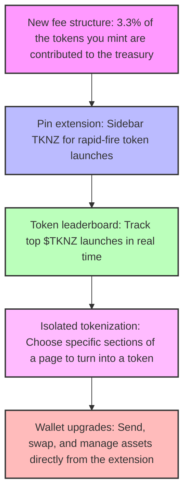

# Tokenz (LLM-Driven Token Creation Extension)

# tests tests tests - establish our baseline of functionality and reliability, because we'll be building and moving

# meta descriptions/twitter cards not working

# make changes stick between  opens, not overwrite when re-opening

# custom uploads for the images.
# brave compatability?

# sidebar

# Isolate any portion of the page, and then have the tokenizer focus on that.

safeguard against bundling?

# Enhanced Wallet Extension
## Core Token Actions
- Buy, sell and send tokens
- One-click "Buy TKNZ" from within the app
- Isolating real estate on a site to tokenize

# 
- distrubute to the holders

## Trading
- Integrated orderbook / swap flows

## Onboarding
- Guided account setup 
- Automatic wallet provisioning

## Token Gating
- Restrict content or app features by token balance  
- Dual-fee model (to cover Solana network fees)  
- Reference implementation: https://x.com/travisbickle0x/status/1917702702240321999

## Rewards & Yield
- Automatic distribution of a % of platform fees or rewards to token holders

## Treasury Management
- Dedicated multisig treasury for fee accumulation  
- Transparent on-chain reporting
- New fee structure – 3.3% of the tokens you buy on creation now go to the treasury

## App Availability
- Browser extension (primary)  
- Standalone mobile/desktop app (TBD)
- Pin extension – Lock TKNZ on-screen for rapid launches

## User Education
- Explainer video on main website  
- In-app tooltips and step-by-step guides

## Community Engagement
- "Coin Create" contest to incentivize user-generated token launches
- Token leaderboard – Track top launches in real time

## Development Timeline

