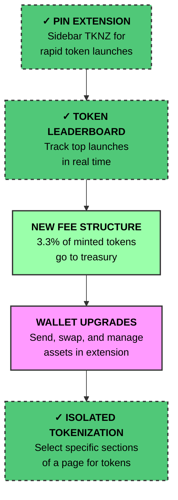

t k
n z

## App useability

- [ x ] Isolating real estate on a site to tokenize
- [ x ] Pin extension – Lock TKNZ on-screen for rapid launches
- [ x ] Custom token image uploads
- [ x ] custom AI prompts

## Community Engagement

- [ x ] - "Coin Create" contest to incentivize user-generated token launches
- [ x ] - Token leaderboard – Track top launches in real time

### Enhanced Wallet functionality

- Full wallet capability
  - Password Wall
     - Seedphrase copy / confirm
     - Passkey Integration
  - Wallet update / create
  - Wallet import
  - Wallet Connect / Standard Wallet Connection

## APIs / Extendability

- [ x ] Leaderboard API

## Trading

- Integrated orderbook / swap flows
- Token Swap / use jup.ag
- purchase tickers from x

## Treasury Management

- Dedicated multisig treasury for fee accumulation  
- Transparent on-chain reporting
- New fee structure – 3.3% of the tokens you buy on creation now go to the treasury
  - Ref: https://x.com/travisbickle0x/status/1917702702240321999

## Rewards & Yield

- Automatic distribution of a % of platform fees or rewards to token holders

## Onboarding

- Guided account setup [ in progress ]
- [ x ] Automatic wallet provisioning

## App Availability

- Browser extension (Chrome/Brave) (primary)  
- Standalone mobile/desktop app (TBD)

## User Education

- [ x ] Explainer video on main website  
- In-app tooltips and step-by-step guides

## Development Timeline

